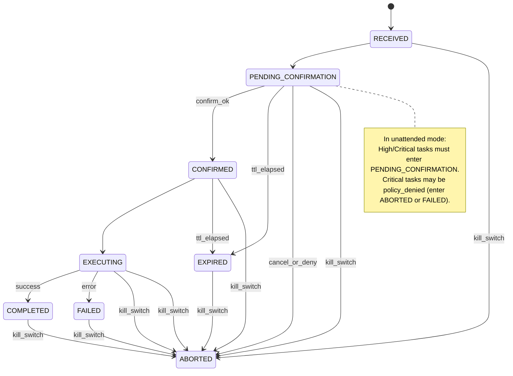

# 产品需求文档（PRD）：WinAgent 任务确认模块

---

## 1. 概述

本产品需求文档（PRD）旨在详细描述 WinAgent 任务确认模块的设计与实现要求。该模块负责对系统中的关键任务进行确认管理，确保任务执行的安全性和可控性。文档涵盖任务模型定义、状态机设计、接口规范、日志审计、异常处理等方面内容，以指导后续开发与测试工作。

---

## 2. 目标

- 实现任务的确认机制，支持关键任务的二次确认流程。
- 定义清晰的任务生命周期状态机，确保任务状态转换的严谨性。
- 提供完整的审计日志，满足安全合规要求。
- 支持多种任务来源，兼容现有系统架构。
- 保证模块的高可用性与易维护性。

---

## 3. 术语定义

| 术语                     | 说明                           |
| ------------------------ | ------------------------------ |
| Task                     | 系统中的一个操作任务           |
| Agent                    | 执行任务的代理程序             |
| Channel                  | 任务来源渠道，如 CLI、API 等   |
| 状态机（State Machine）  | 任务状态的有限状态自动机       |
| TTL                      | 任务确认的超时时间             |
| 二次确认（Confirmation） | 对关键任务执行前的用户确认操作 |

---

## 4. Task 模型定义

### 4.1 Task 基本结构

任务模型采用 JSON 格式定义，包含任务的基本信息、来源、状态及时间戳等字段。示例：

```json
{
    "id": "task-123456",
    "type": "file_delete",
    "source": {
        "agent": "agent-01",
        "channel": "cli"
    },
    "parameters": {
        "path": "/var/log/old_logs"
    },
    "status": "RECEIVED",
    "created_at": "2026-02-04T10:15:30Z",
    "updated_at": "2026-02-04T10:15:30Z",
    "ttl_seconds": 300,
    "confirmation_required": true
}
```

字段说明：

- `id`：任务唯一标识符。
- `type`：任务类型。
- `source`：任务来源，包含执行代理和渠道信息。
- `parameters`：任务执行参数。
- `status`：任务当前状态，取值为状态机定义的枚举字符串。
- `created_at`：任务创建时间，ISO 8601 格式。
- `updated_at`：任务最后更新时间，ISO 8601 格式。
- `ttl_seconds`：任务确认超时时间，单位秒。
- `confirmation_required`：是否需要二次确认。

### 4.2 Task 生命周期状态机

任务状态机定义了任务从接收至完成的各个阶段状态，确保任务按序推进，避免状态跳跃。状态列表如下：

- RECEIVED：任务已接收，等待处理
- PENDING_CONFIRMATION：任务待确认，等待二次确认
- CONFIRMED：任务已确认，准备执行
- EXECUTING：任务执行中
- COMPLETED：任务成功完成
- FAILED：任务执行失败
- ABORTED：任务被中止
- EXPIRED：任务超时失效

禁止状态跳跃，必须按顺序推进，确保流程严谨。

### 4.3 状态机图（Mermaid）



禁止状态跳跃，确保状态按流程顺序推进。默认拒绝未明确确认的操作，确认行为作为安全事件被严格记录。

---

## 5. 接口规范

### 5.1 任务创建接口

- **请求方法**：POST
- **请求路径**：/api/tasks
- **请求体**：

```json
{
    "type": "string",
    "source": {
        "agent": "string",
        "channel": "string"
    },
    "parameters": {},
    "confirmation_required": true,
    "ttl_seconds": 300
}
```

- **响应体**：

```json
{
    "id": "string",
    "status": "RECEIVED",
    "created_at": "string"
}
```

### 5.2 任务确认接口

- **请求方法**：POST
- **请求路径**：/api/tasks/{id}/confirm
- **请求体**：

```json
{
    "confirmation_id": "string"
}
```

- **响应体**：

```json
{
    "id": "string",
    "status": "CONFIRMED",
    "updated_at": "string"
}
```

### 5.3 任务状态查询接口

- **请求方法**：GET
- **请求路径**：/api/tasks/{id}
- **响应体**：

```json
{
    "id": "string",
    "type": "string",
    "status": "string",
    "created_at": "string",
    "updated_at": "string",
    "parameters": {},
    "source": {
        "agent": "string",
        "channel": "string"
    }
}
```

---

## 6. 任务确认策略

- 关键任务必须经过二次确认，确认操作需记录确认ID与时间。
- 非关键任务可跳过确认步骤，直接进入执行阶段。
- 确认超时任务自动进入 EXPIRED 状态，阻止后续执行。
- 支持取消与拒绝操作，进入 ABORTED 状态。
- 确认操作仅允许在 PENDING_CONFIRMATION 状态执行，防止非法状态跳转。

---

## 7. 审计日志设计

任务确认模块需生成详细审计日志，记录任务状态变更、确认操作、异常事件等信息。日志格式示例：

```json
{
    "timestamp": "2026-02-04T10:20:00Z",
    "task_id": "task-123456",
    "event": "confirm",
    "status_before": "PENDING_CONFIRMATION",
    "status_after": "CONFIRMED",
    "confirmation_id": "conf-7890",
    "user": "admin"
}
```

日志字段说明：

- `timestamp`：事件发生时间。
- `task_id`：关联任务ID。
- `event`：事件类型，如 confirm、abort、expire 等。
- `status_before`：事件前状态。
- `status_after`：事件后状态。
- `confirmation_id`：确认操作唯一标识。
- `user`：操作用户标识。

---

## 8. 异常处理

- 状态机非法跳转请求应返回错误，拒绝执行。
- 确认超时自动触发 EXPIRED 状态。
- 任务执行失败时，状态转为 FAILED，记录失败原因。
- 支持手动中止任务，状态转为 ABORTED。
- 所有异常事件均需记录审计日志。

---

## 9. 示例

### 9.1 任务创建示例

请求：

```json
{
    "type": "file_delete",
    "source": {
        "agent": "agent-01",
        "channel": "cli"
    },
    "parameters": {
        "path": "/var/log/old_logs"
    },
    "confirmation_required": true,
    "ttl_seconds": 300
}
```

响应：

```json
{
    "id": "task-123456",
    "status": "RECEIVED",
    "created_at": "2026-02-04T10:15:30Z"
}
```

### 9.2 审计日志示例

```json
{
    "timestamp": "2026-02-04T10:17:00Z",
    "task_id": "task-123456",
    "event": "confirm",
    "status_before": "PENDING_CONFIRMATION",
    "status_after": "CONFIRMED",
    "confirmation_id": "conf-7890",
    "user": "admin"
}
```

---

## 10. 性能需求

- 支持每秒至少 1000 条任务创建与确认请求。
- 状态查询接口响应时间不超过 100ms。
- 审计日志写入延迟不超过 200ms。

---

## 11. 安全性考虑

- 确认操作需身份验证与权限校验。
- 审计日志完整性保护，防止篡改。
- 禁止未授权用户进行任务确认或中止操作。
- 任务状态转换严格受控，防止非法状态跳转。

---

## 12. 小结

任务确认模块通过严格定义任务模型和状态机，确保关键任务的安全执行。完善的接口设计和审计日志机制保障系统的可追溯性和合规性。异常处理与安全策略的落实提升了系统的稳定性和安全性。该模块为 WinAgent 提供了可靠的任务管理基础，支持未来功能扩展和安全增强。
